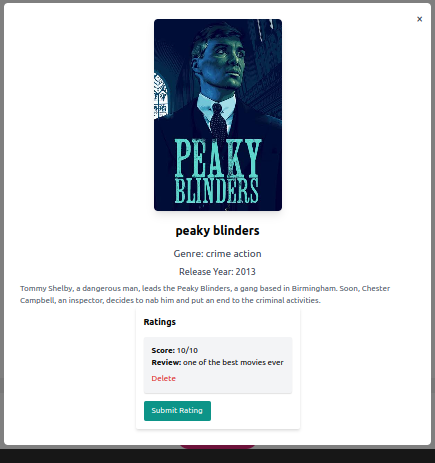
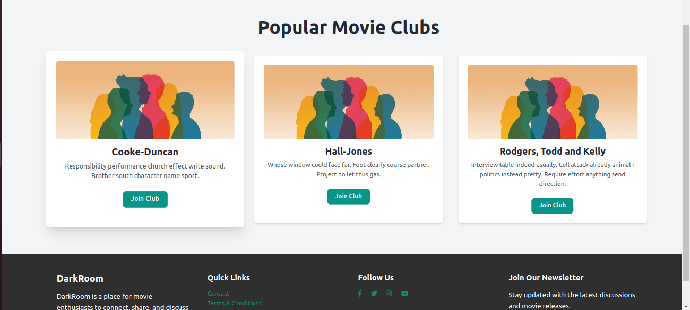

## DARKROOM - Movies/Series Club App

## Table of Contents

- [Overview](#overview)
- [Screenshots](#screenshots)
- [Project Structure](#project-structure)
- [Features](#features)
- [Getting Started](#getting-started)
  - [Prerequisites](#prerequisites)
  - [Installation](#installation)
  - [Running the Application](#running-the-application)
- [Scripts](#scripts)
- [Technologies Used](#technologies-used)
- [Contributing](#contributing)
- [License](#license)
- [Contact](#contact)

## Overview

Darkroom is a Movies/Series Club app designed to enhance the user experience through seamless organization, virtual screenings, discussions, personalized recommendations, and inclusive engagement tools. This README provides a comprehensive overview of the code structure, functionality, and guidance on getting started with the project.

## Screenshots



)

## Project Structure

```bash
project-root/
├── client
│   ├── eslint.config.js
│   ├── index.html
│   ├── node_modules
│   ├── package.json
│   ├── package-lock.json
│   ├── postcss.config.js
│   ├── src
│   └── tailwind.config.js
├── image-1.png
├── image-2.png
├── image.png
├── k.txt
├── README.MD
└── server
    ├── app.py
    ├── DarkRoom
    ├── instance
    ├── migrations
    ├── models
    ├── Pipfile
    ├── Pipfile.lock
    ├── render.yaml
    ├── requirements.txt
    ├── seed.py
    ├── start.sh
    └── tests

```

## Features

Darkroom provides an extensive set of features for users to engage with movies and series:

- **User Accounts**: Sign up, log in, and manage your profile.
- **Community Engagement**: Join or create movie clubs based on genres, and interact with posts from individuals and communities.
- **Post Sharing**: Add and share reviews, ratings, and thoughts on movies or series.
- **Social Connections**: Follow/unfollow members inside or outside movie clubs.
- **Personalized Tracking**: Maintain a record of watched movies and share your experiences.
- **Discussions & Reviews**: Comment and rate posts shared by others.

## Usage
Once the application is running, users can:

- Sign Up: Create an account by providing necessary details.
- Login: Access their account using their credentials.
- Manage Profile: Update their profile information.
- Create Posts: Share their movie-watching experiences.
- Join Clubs: Explore


## Getting Started

### Prerequisites

Ensure you have the following installed on your machine:

- **Node.js** (v14 or later)
- **npm** (comes with Node.js) or **yarn**
- **Python** (v3.12)
- **Pipenv**
- **PostgreSQL**

### Installation

1. **Clone the Repository**

   ```bash
   git clone https://github.com/yourusername/darkroom.git
   cd darkroom
   ```

    Replace `<my-project>` in the above comamnd with your desired project name

2. **Set Up the Backend**

   Navigate to the project root and install Python dependencies using Pipenv:

   ```bash
   pipenv install
   ```

   Activate the Pipenv shell:

   ```bash
   pipenv shell
   ```

3. **Set Up the Frontend**

   Navigate to the `client` directory and install Node.js dependencies:

   ```bash
   cd client
   npm install
   ```

4. **Initializing git**

    - Create a an empty git repository on a github account of your choice.
    - The name of the repository should be guided by the name of the folder you selected in [step 1](#installation) above

        In my case, I named the copy of the starter project `DARKROOM`.

        So my new github repository will consequently be named `DARKROOM`

    - ***Note***: Do not initalize the repository with a `README.md` file, a `.gitignore` file or a `LICENSE.md` file as demonstrated below

        

    - Click on the create repository button

        

    - Create your first commit

      

1. **Start the Flask Backend**

   Ensure you're in the Pipenv shell and run from the `server` directory:

   ```bash
   python server/app.py
   ```

   The backend server will start on `http://localhost:5555`.

2. **Start the React Frontend**

   Open a new terminal, navigate to the `client` directory, and run:

   ```bash
   npm run dev
   ```

   The frontend application will start on `http://localhost:5173` and proxy API requests to the Flask backend.

3. **Access the Application**

   Open your browser and navigate to `http://localhost:5173` to see the application in action.

4. **Access backend**
Open your browser and navigate to `https://darkroombackend.onrender.com`

## Scripts`

### Backend

- **Run Server**

  ```bash
  python server/app.py
  ```

### Frontend (Client)

- **Start Development Server**

  ```bash
  npm run dev
  ```

## Technologies Used

- **Frontend**

  - [React](https://react.dev/)
  - [Vite](https://vite.dev/)
  - [ESLint](https://eslint.org/)
  - [SWC](https://swc.rs/) for Fast Refresh

- **Backend**

  - [Flask](https://flask.palletsprojects.com/)
  - [Gunicorn](https://gunicorn.org/)
  - [api](https://darkroombackend.onrender.com)

- **Others**
  - [Pipenv](https://pipenv.pypa.io/)
  - [Python 3.12](https://www.python.org/)
  - [Node.js](https://nodejs.org/)
  - [Postgresql](https://www.postgresql.org/)

## Contributing

Contributions are welcome! Please follow these steps:

1. **Clone the Repository**

2. **Create a Feature Branch**

   ```bash
   git checkout -b feature/YourFeature
   ```

3. **Commit Your Changes**

   ```bash
   git commit -m "Add some feature"
   ```

4. **Push to the Branch**

   ```bash
   git push origin feature/YourFeature
   ```

5. **Open a Pull Request**

### Authors'

[Sharon Kahira](https://github.com/Her-Code)
[Edwin Ng'anga](https://github.com/Programer-Ed)
[Favoured Mwange](https://github.com/fevado)
[Barkley Igonyi](https://github.com/Bwanaigonyi)
[Bakari Bubu](https://github.com/BAKARIBUBU)

## License

This project is licensed under the [MIT License](LICENSE).

## Contributions
1. Bakari Bubu
2. Favoured Mwange
3. Sharon Kahira
4. Barkley Igonyi
5. Edwin Ng'ang'a


### Contact

For any questions or feedback, please contact **Sharon Kahira** at [wanjiku.kahira@gmail.com](wanjiku.kahira@gmail.com),**Bakari Bubu** at [bakaribubu@gmail.com](bakaribubu@gmail.com),**Favoured Mwange** at [mwangefavoured@gmail.com](mwangefavoured@gmail.com),**Edwin Nganga** at [moyiedwin8@gmail.com](moyiedwin8@gmail.com) ,**Barkley Igonyi** [Igonyibarkley00@gmail.com](Igonyibarkley00@gmail.com)
